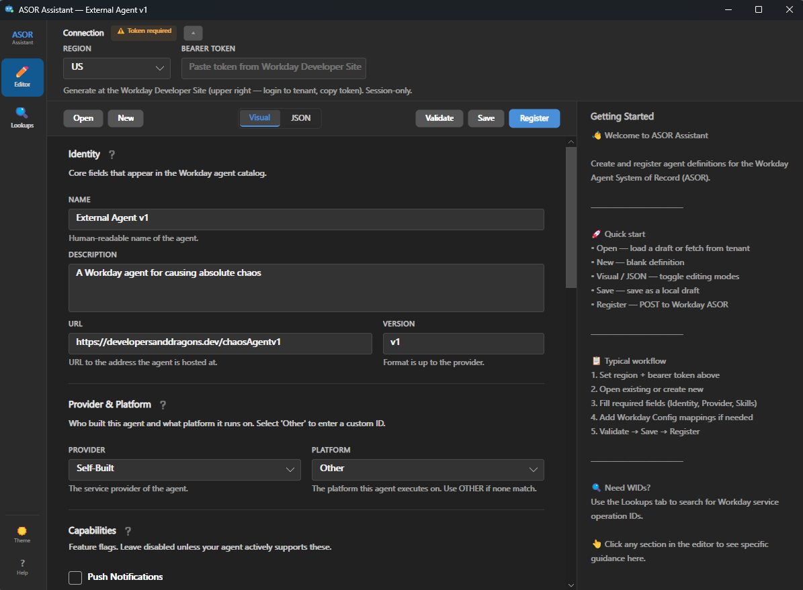
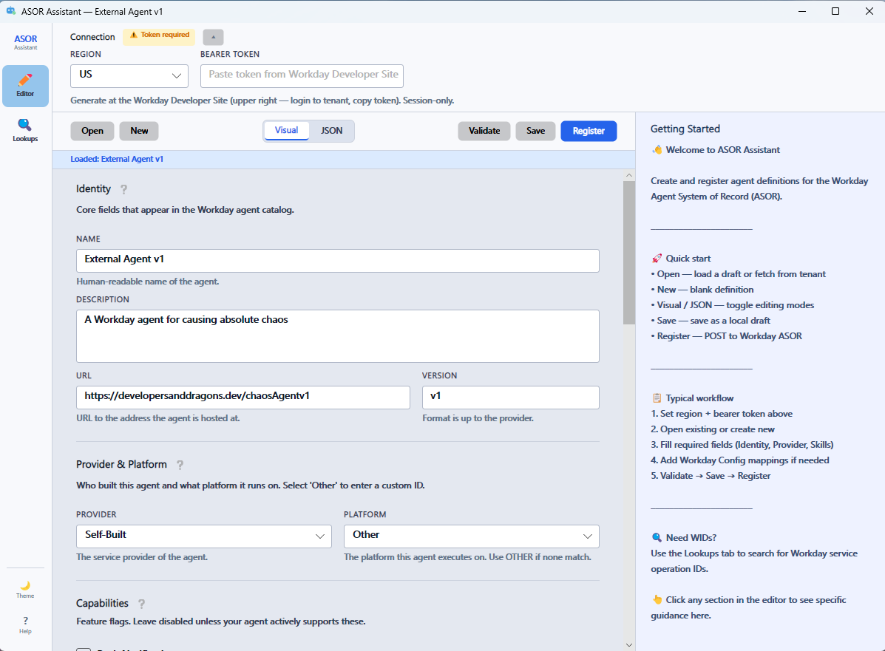

# ASOR Assistant

A desktop app for authoring, validating, and registering external agents against the Workday Agent System of Record (ASOR).

[](https://dotnet.microsoft.com/)
[](https://avaloniaui.net/)
[](https://github.com/Developers-and-Dragons/asor-assist/releases)

---

## Why this tool exists

Registering external agents should not feel like deciphering an ancient scroll while manually stitching together JSON, WIDs, and tenant configuration.

ASOR Assistant exists to make that workflow faster, clearer, and less error-prone with a purpose-built desktop editor for the ASOR registration flow.

Use it to:

- build agent definitions visually
- switch to raw JSON when you want full control
- validate against the ASOR v1.2 spec
- fetch existing registered agents from a tenant
- register directly to Workday
- look up SOAP and REST service WIDs
- save local drafts as you work

---

## Screenshots

**Dark mode**


**Light mode**


---

## Features

- **Visual editor** for authoring ASOR agent definitions
- **JSON editor** for direct payload editing
- **Spec-aware validation** against ASOR v1.2
- **Tenant fetch** for pulling existing registered agents
- **Direct registration** to the Workday ASOR API
- **Service operation lookups** for SOAP and REST WIDs
- **Local drafts** for saving work in progress
- **Contextual guidance** in the built-in help panel

---

## Download

Get the latest build from [GitHub Releases](https://github.com/Developers-and-Dragons/asor-assist/releases).

| Platform | File | Notes |
|---|---|---|
| Windows x64 | `AsorAssistant_Windows_x64.zip` | EV code signed |
| macOS ARM64 | `AsorAssistant_macOS_ARM64.dmg` | Signed and notarized |

---

## Quick Start

### 1. Launch the app

**Windows**
1. Download and extract `AsorAssistant_Windows_x64.zip`
2. Run `AsorAssistant.App.exe`

> **SmartScreen note**  
> Windows may show **“Windows protected your PC”** for newer releases until reputation builds.  
> Choose **More info** → **Run anyway** to continue.

**macOS**
1. Download `AsorAssistant_macOS_ARM64.dmg`
2. Open the DMG and drag **Asor Assistant** to **Applications**
3. Launch from Finder or Launchpad

> **Gatekeeper note**  
> On first launch, macOS may require approval.  
> If prompted, right-click the app and choose **Open** once.

### 2. Connect to your tenant

In the app:

1. Select your **region**
2. Paste a **bearer token** from the Workday Developer Site  
   *(upper-right menu after logging into the tenant)*

### 3. Build or open an agent definition

From there, you can:

1. **Open** an existing local draft or fetch an existing agent from a tenant
2. Fill in required sections such as **Identity**, **Provider & Platform**, and **Skills**
3. Add **Workday configuration** and map required resources
4. Use **Lookups** to find SOAP and REST WIDs
5. **Validate** the definition
6. **Save** a local draft
7. **Register** the agent to ASOR

---

## ASOR v1.2 Support

ASOR Assistant targets the [ASOR v1.2 specification](https://github.com/Workday/asor/blob/main/versions/v1.2.md).

### Regional endpoints

| Region | Endpoint |
|---|---|
| US | `https://us.agent.workday.com` |
| EU | `https://eu.agent.workday.com` |
| UK | `https://uk.agent.workday.com` |
| SIN | `https://sg.agent.workday.com` |
| IND | `https://in.agent.workday.com` |
| JPN | `https://jp.agent.workday.com` |

---

## Build from source

ASOR Assistant requires the [.NET 10 SDK](https://dotnet.microsoft.com/download).

```bash
dotnet build AsorAssistant.slnx
dotnet run --project src/AsorAssistant.App
dotnet test AsorAssistant.slnx
```

---

## License

Licensed under the **MIT License** — see [LICENSE](LICENSE).
